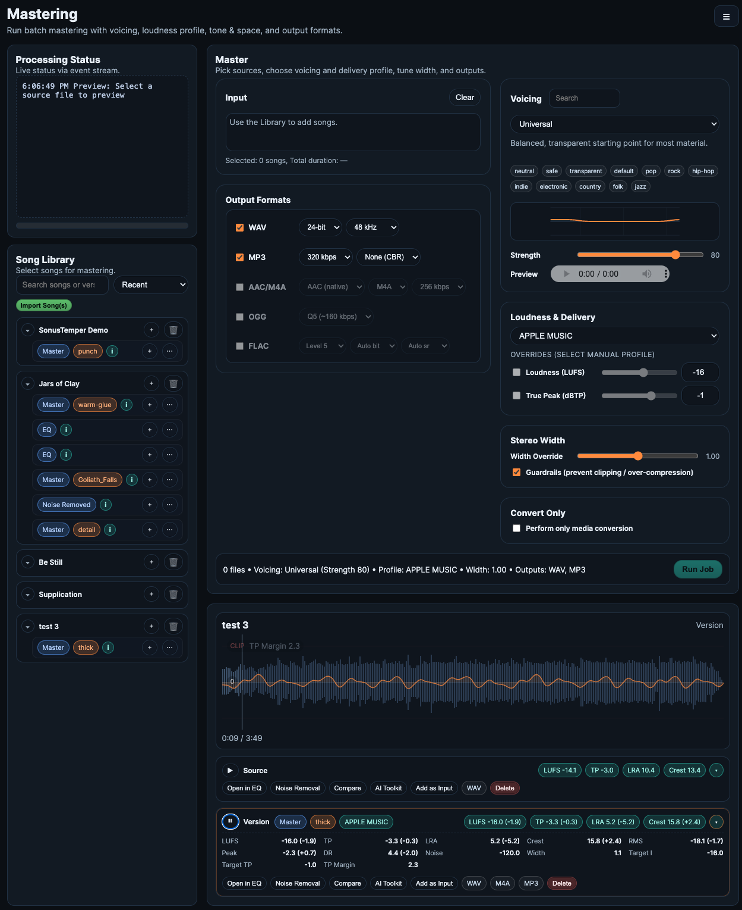
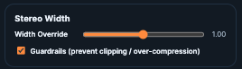
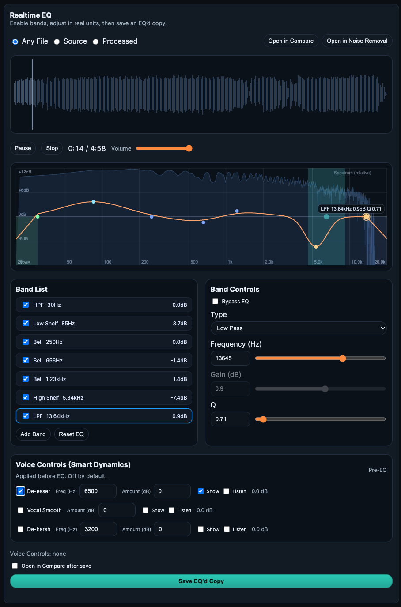

#  SonusTemper

SonusTemper is a local-first audio workstation: master, compare, clean noise, tag, and manage your library. Everything runs locally (FastAPI + FFmpeg), with deterministic naming, metrics, and provenance files for traceable results.



### First Run (Required)
SonusTemper will refuse to start with default placeholder secrets.
1) Copy `.env.example` to `.env`
2) Set:
   - `BASIC_AUTH_PASS` (must NOT be `CHANGEME`)
   - `PROXY_SHARED_SECRET` (must NOT be `changeme-proxy`)
3) Run: `docker compose up`

## What you can do
- Master with **Voicings** or **User Presets** (profiles/voicings), with loudness, true‑peak, stereo, and tone controls. See [Mastering](docs/mastering.md).
- Clean noise with **Noise Removal** (Preset vs Selected/Marquee workflows). See [Noise Removal](docs/noise-removal.md).
- Compare **Source vs Processed** with synced playback, waveform/spectrogram, and overlays. See [Compare](docs/compare.md).
- Use **AI Music Toolkit** for smart cleanup recommendations and real‑unit controls. See [AI Music Toolkit](docs/ai-toolkit.md).
- Shape audio in **EQ** with realtime filters, spectrum/curve, and Voice Controls. See [EQ](docs/eq.md).
- Tag MP3s (library or standalone) with batch editing and downloads. See [Tagging](docs/tagging.md).
- Manage your library, versions, and user presets in **Song Library** and **Preset Management**. See [Song Library](docs/library.md) and [Preset Management](docs/preset-management.md).

## UI tour
### Mastering — Voicings and User Presets ([docs](docs/mastering.md))
- Two modes (mutually exclusive). Default is **Voicing**; switch to **User Presets** to pick one preset. Switching modes clears the other selection.
- Single-select tiles with info drawers that explain “what it does,” “best for,” and “watch-outs.”
- Strength/Intensity slider applies to whichever mode is active.


### Loudness
- Two-pass, static gain: first measure LUFS/true-peak, then apply a fixed offset to hit target LUFS. Skips gain if already within ±1 LU. True-peak ceiling is always enforced.


### Stereo & Tone
- Optional stereo widening with guardrails and light tone shaping (EQ/comp). Voicings/presets supply their EQ/comp curves; stereo width is applied when enabled.



### Output
- Select any formats you want; each stage is optional. You can simply transcode WAV ➜ MP3 (or any format) by leaving mastering stages off.
- Formats and options:
  - WAV: sample rate/bit depth
  - MP3: CBR bitrates or VBR (V0/V2)
  - AAC/M4A: bitrate + container
  - OGG Vorbis: quality level
  - FLAC: compression level + optional rate/depth


### Processing Status, Previous Runs, Job Output
- Processing Status lists each step (voicing/preset render, loudness, per-format exports, metrics).
- Previous Runs updates only after a job fully finishes (including metrics) and lets you reload a past run into Job Output.
- Job Output shows playback, per-format download links, delete links, and the metrics panel (LUFS, TP, LRA, crest, DR, noise, duration, width, etc.).

### Status delivery (SSE, no polling)
- Runs start via `/api/run` and stream status over Server-Sent Events from `/api/status-stream?song=<run_id>`.
- The UI reconnects once via `/api/run/<run_id>` if the stream drops, so there’s no `.processing` file polling.
- A tiny in-memory registry keeps the last N events per run for fast replay; terminal events include outlist/metrics payloads so the UI can render immediately.

## Noise Removal ([docs](docs/noise-removal.md))
- Two workflows:
  - **Preset Noise Removal** (full‑song, preset‑based cleanup)
  - **Selected Noise Removal** (marquee selection with Solo Noise vs Filtered Song audition)
- Save outputs as library versions; presets can be saved from selections and appear in Preset Management.

## Compare ([docs](docs/compare.md))
- Synchronized Source/Processed playback with waveform or spectrogram view.
- Overlays for loudness/peak risk and a scrub‑ready overview window.
- Open any library version in Compare for A/B.

## AI Music Toolkit ([docs](docs/ai-toolkit.md))
- Smart recommendations based on /api/ai-tool/detect (real units, gated by enable toggles).
- Render cleaned versions to the library with full metrics.

## EQ ([docs](docs/eq.md))
- Realtime WebAudio EQ with spectrum + curve, band handles, and Voice Controls (pre‑EQ).
- Save EQ’d versions back to the library; open in Compare or Analyze/Noise Removal.



## Tagging ([docs](docs/tagging.md))
- Tag library MP3s or upload standalone MP3s (temp, non‑library) for tagging and download.
- Batch editing across selected tracks with shared-field prefill.

## Preset Management ([docs](docs/preset-management.md))
- Manage user voicings, profiles, and noise presets.
- Create voicing/profile from reference audio (analyzed server‑side; reference discarded).

## Naming, metrics, provenance
- Outputs share a deterministic variant tag built from the effective config (preset/voicing, strength, loudness target/TP, stereo width/guardrails, and encoding options). A length guard adds a short hash if needed.
- Each mastered file has siblings:
  - `<stem>__<variant>.metrics.json` (analysis)
  - `<stem>__<variant>.run.json` (provenance: exact payload + resolved values)
- Delete links/API remove the audio plus its metrics/provenance companions.


## ID3 Tag Editing
- Add processed MP3s or upload standalone MP3s to apply tags and album art.
- Download individual songs or a full album after tagging.


## Data paths
- Root defaults to `/data`. For local dev, set `DATA_DIR=./data` (or `SONUSTEMPER_DATA_ROOT`) if `/data` is not writable.
- Song audio:
  - Sources: `./data/library/songs/<song_id>/source/`
  - Versions: `./data/library/songs/<song_id>/versions/`
- User presets: `${DATA_DIR}/user_presets/{voicings,profiles,noise_filters}/`
- Previews (session temp): `./data/previews/` (TTL-cleaned, non‑persistent)
- Tagging temp uploads: `./data/previews/mp3-temp/<session>/` (cleared by temp cleanup)

## Install & run
### Docker (recommended)
```bash
cp .env.example .env   # optional: set PORT, SONUSTEMPER_TAG
# Set Basic Auth creds (required): edit .env to change BASIC_AUTH_PASS from CHANGEME
# Optional: set API_KEY only for CLI scripts (UI does not use it)
docker compose pull
docker compose up -d
# open http://localhost:${PORT:-8383}
```
Mounts (defaults):
- `./data` -> `/data` (all app data: library, presets, previews)

### Docker (dev build)
```bash
cp .env.example .env
docker compose -f docker-compose.dev.yml up --build
```

### Local (no Docker)
- Requires Python 3.11+ and ffmpeg/ffprobe on PATH.
- Env defaults: `DATA_DIR=/data` (override with `SONUSTEMPER_DATA_ROOT` or `DATA_DIR` if needed).
```bash
uvicorn sonustemper.server:app --reload --port 8383
```

### Native Builds (planned)
- macOS/Windows bundles will include ffmpeg/ffprobe; end users install nothing.
- Maintainers: place `sonustemper-ui/app/static/vendor/htmx.min.js` and `vendor/ffmpeg/<platform>/` binaries before packaging.
- Maintainers: see packaging docs for where bundled binaries are sourced.

### Native Builds
macOS (menubar support):
```bash
python -m venv .venv-native && source .venv-native/bin/activate
pip install -e ".[dev,macos]"
pyinstaller build/native/sonustemper.spec
```

Windows/Linux:
```bash
python -m venv .venv-native && activate
pip install -e ".[dev]"
pyinstaller build/native/sonustemper.spec
```

Notes:
- Native builds require ffmpeg/ffprobe on PATH (for now).
- If missing, Health will show not-ready and mastering features won’t run.

### Maintainers
- Generate a Python dependency/license snapshot: `python3 scripts/licenses_report.py` (writes `docs/python-deps.md`).
- Native smoke test: `python -m sonustemper.smoke_test`.

### Logging
- `LOG_LEVEL` controls structured logs from the mastering pipeline: `error` (default), `summary`, `debug`.
- Levels include tagged prefixes like `[error][master]`, `[summary][loudnorm]`, `[debug][ffmpeg]`; secrets are redacted.

## Documentation
Docs live in `docs/`. Enable GitHub Pages (Settings → Pages → Deploy from branch, `/docs`) to publish.
- Set in `.env` for docker (e.g., `LOG_LEVEL=summary`) or export before running locally.
Quick links:
- [Overview](docs/index.md)
- [Mastering](docs/mastering.md)
- [Song Library](docs/library.md)
- [Noise Removal](docs/noise-removal.md)
- [Compare](docs/compare.md)
- [AI Music Toolkit](docs/ai-toolkit.md)
- [EQ](docs/eq.md)
- [Preset Management](docs/preset-management.md)
- [Tagging](docs/tagging.md)
- [Workflows](docs/workflows.md)
- [Troubleshooting](docs/troubleshooting.md)

### Security defaults
- Proxy-level Basic Auth is ON by default (BASIC_AUTH_ENABLED=1).
- Defaults in `.env.example`: user `admin`, pass `CHANGEME`. You must change the password; proxy will refuse to start if unchanged.
- PROXY_SHARED_SECRET must be changed from the default `changeme-proxy` or containers will refuse to boot.
- Strict config is enabled by default (SONUSTEMPER_STRICT_CONFIG=1); disable only for local dev.
- All UI/API/SSE routes are behind Basic Auth.
- The optional `API_KEY` is only for non-browser clients/CLI scripts; it is not embedded in the UI and is not required once Basic Auth succeeds. Proxy adds its own shared-secret header internally.
- If `API_KEY`/`PROXY_SHARED_SECRET` are **not** set, the API only accepts localhost requests by default.
  - Set `API_ALLOW_UNAUTH=1` to allow unauthenticated API access (local dev only).
  - If `PROXY_SHARED_SECRET` is set, the proxy can still allow LAN/remote access by injecting `X-SonusTemper-Proxy`.
- See `SECURITY.md` for the security posture and hardening notes (proxy perimeter, shared credentials, not Internet-facing without TLS/VPN).

## Images and tags
- GHCR: `ghcr.io/jasondaemon/sonustemper`
- Set `SONUSTEMPER_TAG` to a release tag (`vX.Y.Z`) or use `latest`. 

## Health
`GET /health` reports ffmpeg/ffprobe availability, directory writability, preset status, build/app id.

## Links
- Security: `SECURITY.md`
- Changelog: `CHANGELOG.md`
- License: `LICENSE`
- Third-party notices: `THIRD_PARTY_NOTICES.md`

## Quick regression checklist
- Single-run happy path: one file, one voicing, all outputs, confirm status stream completes and Job Output auto-loads.
- Multi-file run: two files, mixed formats, confirm a single SSE stream drives status and both appear in Previous Runs.
- SSE reconnect: refresh the page mid-run; ensure status replays via `/api/run/<run_id>` and finishes cleanly.
- Error path: intentionally bad preset/voicing to verify terminal `error` event stops the stream and UI doesn’t spin.
- Analyze (Noise Cleanup): open Analyze, select a run/output, drag a spectrogram region, preview Solo/Remove, then render a cleaned copy and download the result.
- AI Music Toolkit: open AI Music Toolkit, pick a source/processed file, preview a cleanup tool, apply it, and open the result in Compare.

## AI Music Toolkit
The AI Music Toolkit provides cleanup workflows with real‑unit controls, preview‑first adjustments, and full renders to the library (never overwrites).

## License
- SonusTemper is licensed under the GNU General Public License v3.0 (GPL-3.0).
- You may use, modify, and redistribute under the terms of the GPL-3.0.
- SPDX-License-Identifier: GPL-3.0-only
- FFmpeg is installed from the distro package and remains under its original LGPL/GPL licensing; see `THIRD_PARTY_NOTICES.md` for details.

## Future Features
- Audio Analysis
  - Loudness Report
  - Streaming platform complaince
  - Potential cliping
- Frequency Filtering
- Drag and Drop file handling
- Enhanced file management
- Preset Manager enhancement
