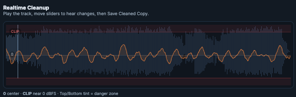
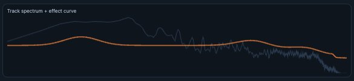
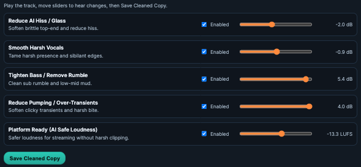
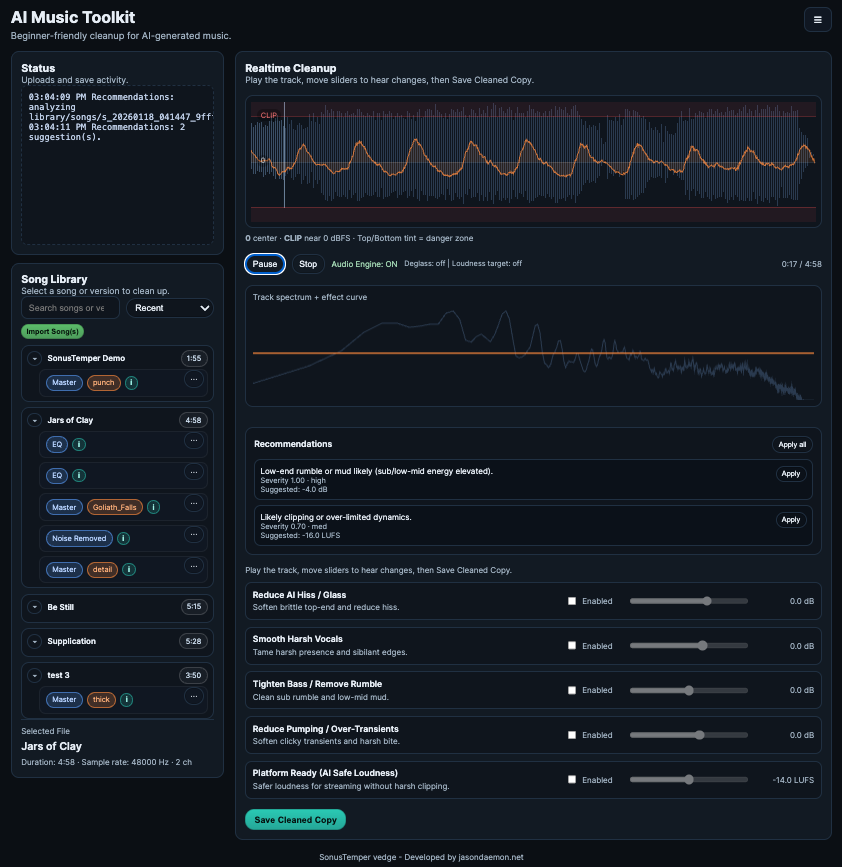

# AI Toolkit

## 🧭 Table of contents
- [What it does](#what-it-does)
- [When to use it](#when-to-use-it)
- [Step-by-step](#step-by-step)
- [Controls and functions](#controls-and-functions)
- [Common pitfalls](#common-pitfalls)
- [Tips](#tips)
- [Screenshot placeholders](#screenshot-placeholders)

## What it does
AI Toolkit provides real‑time cleanup controls with recommendations derived from track analysis. It uses WebAudio for preview and FFmpeg for final renders.

## When to use it
- Fast cleanup of hiss, harsh vocals, rumble, transients, and platform loudness.
- Beginners who want safe, guided adjustments.

## Step‑by‑step
1) Load a song from the Library.
2) Review **Recommendations** and apply what you want.
3) Enable tools and adjust sliders in real units (dB/LUFS).
4) Listen in real time; tweak as needed.
5) Save a cleaned copy to create a new version.


## Controls and functions

### Waveform + transport
- **Waveform**: Click/drag to seek.
- **Play/Pause/Stop**: Standard playback control.
- **Time display**: Current time and total duration.


### Spectrum + effect curve
- **Spectrum**: Live FFT of playback.
- **Effect curve**: Visual estimate of how sliders affect EQ/loudness.


### Recommendations panel
- **Findings list**: Severity and confidence per issue.
- **Apply** (per finding): Enables that tool and sets suggested value.
- **Apply all**: Enables all suggested tools and sets values.


### Tools (checkbox + slider)
Tools are **OFF by default**. Enabling applies the effect.


- **Reduce AI Hiss / Glass (Deglass)**
  - **Value**: Shelf gain (dB). Negative cuts air; positive adds air.
  - **Behavior**: Optional low‑pass when strongly negative.

- **Smooth Harsh Vocals (Vocal Smooth)**
  - **Value**: Presence gain (dB). Negative softens; positive adds clarity.

- **Tighten Bass / Remove Rumble (Bass Tight)**
  - **Value**: Low‑end shaping (dB). Negative tightens; positive boosts.

- **Reduce Pumping / Over‑Transients (Transient Soften)**
  - **Value**: Transient character (dB). Negative softens; positive adds punch.

- **Platform Ready (AI Safe Loudness)**
  - **Value**: Target LUFS. Lower values reduce loudness; higher values increase.

### Save
- **Save Cleaned Copy**: Renders the full chain server‑side and creates a new version.
- **Output row**: Download / Open in Compare.

> **Warning:** Recommendations are advisory; only enabled tools are applied.

## Common pitfalls
- If recommendations show “unavailable,” check the detect endpoint and logs.
- If audio is silent, confirm the audio engine is running.

## Tips
- Tools are off by default. Enable only what you need.
- Loudness slider is a target; final save uses FFmpeg loudness.


<details>
<summary>Technical Details</summary>

- **Detect (Recommendations)**: `GET /api/ai-tool/detect` runs ffmpeg `astats` over full and segment windows to derive peak/RMS/crest and band ratios for hiss/harsh/mud.
- **Preview chain (WebAudio)**: MediaElementSource -> biquads (shelf/peaking/highpass) -> compressor -> output gain -> analyser -> destination.
- **Render chain (FFmpeg)**: `/api/ai-tool/render_combo` builds an `-af` chain in order: bass tighten -> vocal smooth -> deglass -> transient soften -> platform safe.

Example render chain:
```bash
ffmpeg -y -hide_banner -loglevel error -i input.wav \
  -af "bass=g=-2.5:f=90:w=0.7,highpass=f=45,equalizer=f=4500:t=q:w=1.2:g=-2.0,treble=g=-1.5:f=11000:w=0.7,acompressor=threshold=-22:ratio=2.5:attack=20:release=250,loudnorm=I=-14:TP=-1.2,alimiter=limit=-1.2" \
  output.wav
```

- **Versioning**: Output is saved under the song’s `versions/` folder and registered in SQLite with `utility="AITK"`, plus metrics from analysis.

</details>

