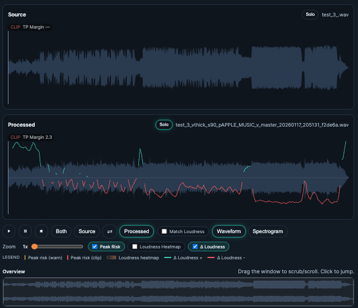
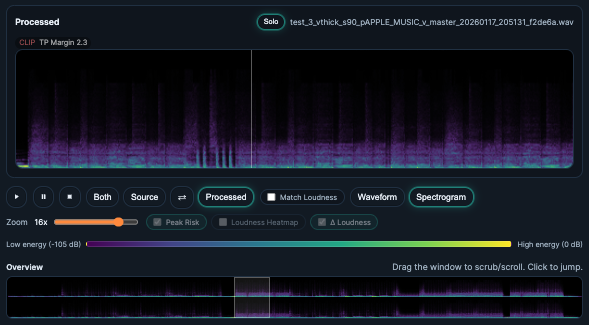

# Compare

## 🧭 Table of contents
- [What it does](#what-it-does)
- [When to use it](#when-to-use-it)
- [Step-by-step](#step-by-step)
- [Controls and functions](#controls-and-functions)
- [Common pitfalls](#common-pitfalls)
- [Tips](#tips)
- [Screenshot placeholders](#screenshot-placeholders)

## What it does
Compare lets you A/B source vs processed versions with synced playback, waveform/spectrogram views, and loudness overlays.

## When to use it
- Validate cleanup and mastering results.
- Check loudness and dynamics changes.
- Visualize differences across time.

## Step‑by‑step
1) Open **Compare**.
2) Select a **Source** and **Processed** track.
3) Choose **Waveform** or **Spectrogram** view.
4) Use the **Overview** window to scrub/scroll.
5) Toggle **Both / Source / Processed** to evaluate changes.

## Controls and functions

### Transport
- **Play/Pause/Stop**: Controls playback for the active mode.
- **Both**: Plays both tracks in sync.
- **Source**: Plays source only (processed muted).
- **Processed**: Plays processed only (source muted).
- **Match Loudness**: Applies gain matching (preview only).

### Waveform view
- **Zoom**: Changes time scale of the main waveform.
- **Overlays**: Peak risk, loudness heatmap, loudness delta.
- **Overview window**: The highlighted viewport used for scrub/scroll.



### Spectrogram view
- **Spectrogram toggle**: Switches to spectral visualization.
- **Spectrogram legend**: Shows energy range.
- **Overview window**: Same scrub/scroll behavior as waveform.


- Zoom in for details


### Overview scrubber
- **Drag**: Scrolls the main view.
- **Click**: Jumps to a position and seeks audio.

> **Warning:** Match Loudness is preview only and does not affect saved files.

## Common pitfalls
- If Match Loudness is on and audio is silent, toggle it off and on again.
- If overlays look misaligned, reset zoom to 1x and re‑enable overlays.

## Tips
- Use Spectrogram to spot hiss/harshness.
- Use Waveform overlays to see loudness deltas.


<details>
<summary>Technical Details</summary>

- **Playback**: HTMLAudioElement for source + processed. WebAudio GainNodes handle Match Loudness.
- **Visualization**: WaveSurfer renders waveform; it does not own audio playback.
- **Spectrogram**: `GET /api/analyze/spectrogram` runs ffmpeg `showspectrumpic`.

Example spectrogram command:
```bash
ffmpeg -y -hide_banner -loglevel error \
  -i input.wav \
  -lavfi "showspectrumpic=s=1200x256:mode=combined:scale=log:legend=disabled:color=viridis:drange=120" \
  -frames:v 1 out.png
```

</details>
