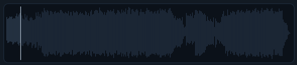
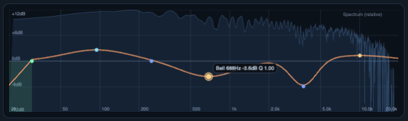
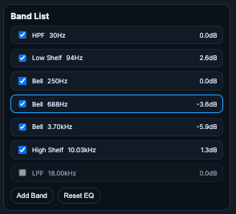
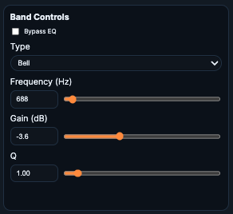
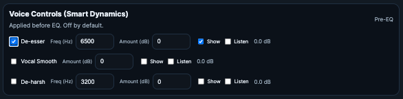

# EQ

## 🧭 Table of contents
- [What it does](#what-it-does)
- [When to use it](#when-to-use-it)
- [Step-by-step](#step-by-step)
- [Controls and functions](#controls-and-functions)
- [Common pitfalls](#common-pitfalls)
- [Tips](#tips)
- [Screenshot placeholders](#screenshot-placeholders)

## What it does
EQ is a soundboard‑style multi‑band EQ with live spectrum, curve editor, and voice controls (de‑esser, vocal smooth, de‑harsh) applied before EQ. It previews in real time and saves a versioned EQ’d copy.

## When to use it
- Tone shaping with a familiar channel‑strip layout.
- Quick vocal cleanup before or after AI cleanup.
- Surgical fixes without a full DAW.

## Step‑by‑step
1) Load a track from the Library.
2) Start with the 7‑band template (HPF, shelves, mids).
3) Drag handles on the canvas to adjust frequency and gain.
4) Enable Voice Controls as needed (use Listen to hunt sibilance).
5) Save an EQ’d copy to create a new version.

## Controls and functions

### Waveform + transport
- **Play/Pause**: Starts or stops playback. If you switch tracks while playing, playback resets to 0.
- **Stop**: Pauses and resets to the beginning.
- **Time display**: Shows current time and duration.
- **Volume**: Adjusts playback volume for preview only.



### Spectrum + EQ canvas
- **Spectrum (live)**: Animated, smoothed FFT behind the EQ curve.
- **EQ curve**: Shows combined EQ response (includes HPF/LPF roll‑off).
- **Grid**: Frequency and dB reference lines; 0 dB is emphasized.
- **Handle drag**:
  - Horizontal drag = frequency.
  - Vertical drag = gain (bell/shelf bands).
  - Shift+drag = finer control.
- **Scroll wheel (Shift)**: Adjusts Q for the selected band.
- **Delete/Backspace**: Removes selected band (non‑template bands by default).



### Band list (left)
- **Enable checkbox**: Turns band on/off.
- **Type label**: HPF, LPF, Low Shelf, High Shelf, Bell.
- **Freq / Gain readout**: Current values per band.
- **Remove (×)**: Only for non‑template bands.



### Band controls (right)
- **Type**: Changes filter type (HPF/LPF/Low Shelf/High Shelf/Bell).
- **Frequency**: Numeric + slider input; log‑scale feel.
- **Gain**: Numeric + slider input; disabled for HPF/LPF.
- **Q**: Numeric + slider input; controls bandwidth (higher = narrower).
- **Bypass EQ**: Disables all EQ bands without deleting them.
- **Reset EQ**: Restores the default 7‑band template.



### Voice Controls (Pre‑EQ)
- Applied before the EQ chain for preview and render.



- **De‑esser**
  - **Enable**: Turns processing on/off.
  - **Freq (Hz)**: Center frequency for sibilance.
  - **Amount (dB)**: Negative values reduce sibilance.
  - **Show**: Display overlay/handle on the canvas.
  - **Listen**: Solo the sibilant band for hunting.

- **Vocal Smooth**
  - **Enable**: Turns processing on/off.
  - **Amount (dB)**: Negative values soften presence.
  - **Show**: Display overlay/handle.
  - **Listen**: Solo the presence band.

- **De‑harsh**
  - **Enable**: Turns processing on/off.
  - **Freq (Hz)**: Center frequency for harshness.
  - **Amount (dB)**: Negative values reduce harshness.
  - **Show**: Display overlay/handle.
  - **Listen**: Solo the harshness band.

**Listen behavior**
- Only one Listen mode is active at a time.
- Listen routes a band‑pass solo to your output for hunting.
- Turning off a Voice Control disables its Listen state.

### Save section
- **Save EQ’d Copy**: Renders and creates a new Library version.
- **Open in Compare after save**: Opens source vs EQ’d version.
- **Result row**: Download, Open in Compare, Open in Noise Removal.

> **Note:** Voice Controls are applied before EQ. EQ bands are applied after.

## Common pitfalls
- If Listen is on, you are hearing a band‑solo preview, not the full mix.
- If nothing changes, confirm a band is enabled and not bypassed.

## Tips
- Use HPF to clean rumble; LPF for harsh top‑end.
- Keep gains small and compare in Compare.
- Use Voice Controls to find problem ranges before EQ moves.

<details>
<summary>Technical Details</summary>

- **Preview chain (WebAudio)**: MediaElementSource -> Voice Controls (peaking EQs) -> EQ bands (biquads) -> analyser -> destination.
- **Listen mode**: A band‑pass solo path is routed to output for hunting; normal chain is muted while Listen is active.
- **Offline render**: `POST /api/eq/render` builds FFmpeg filters: Voice Controls first, then EQ filters.

Example render chain:
```bash
ffmpeg -y -hide_banner -loglevel error -i input.wav \
  -af "equalizer=f=6500:t=q:w=2.0:g=-4.0,equalizer=f=4500:t=q:w=1.2:g=-2.0,highpass=f=30,equalizer=f=100:t=q:w=0.71:g=0,highshelf=f=10000:g=0" \
  output.eq.wav
```

- **Versioning**: EQ saves create a Library version with stored `voice_controls` + `eq_bands`.

</details>
