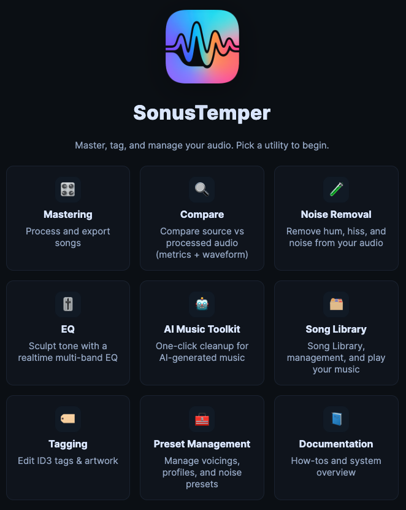

# SonusTemper Documentation

## 🧭 Table of contents
- [What it does](#what-it-does)
- [When to use it](#when-to-use-it)
- [Quick start](#quick-start)
- [Docs map](#docs-map)
- [Common pitfalls](#common-pitfalls)
- [Tips](#tips)
- [Screenshot placeholders](#screenshot-placeholders)

## What it does
SonusTemper is a music finishing toolkit for AI‑generated and real recordings. It focuses on safe, fast cleanup and mastering workflows with a song‑centric library and version tracking.

## When to use it
- You need to clean up a track (Noise Removal, EQ, AI Toolkit).
- You want A/B comparison between versions.
- You need consistent mastering across multiple tracks.

## Quick start
1) Import or select a song from the Library.
2) Use a utility (AI Toolkit, Noise Removal, EQ) to make changes.
3) Save a copy to create a new version.
4) Use Compare to check source vs version.
5) Run Mastering to finalize.

> **Note:** Every save creates a version in the Library; your source stays intact.

## Docs map
| Area | Purpose |
| --- | --- |
| [Library](library.md) | Song + version management |
| [Compare](compare.md) | A/B analysis |
| [AI Toolkit](ai-toolkit.md) | Real‑time cleanup |
| [Noise Removal](noise-removal.md) | Preset + selection denoise |
| [EQ](eq.md) | Soundboard EQ + Voice Controls |
| [Mastering](mastering.md) | Final delivery |
| [Tagging](tagging.md) | ID3 tagging + artwork |
| [Preset Management](preset-management.md) | Voicing/profile/noise presets |
| [Workflows](workflows.md) | End‑to‑end guides |
| [Troubleshooting](troubleshooting.md) | Fix common issues |

## Common pitfalls
- If you do not see a file, refresh the Library or check the import path.
- If playback is silent, verify the browser allowed audio playback and the AudioContext is running.

## Tips
- Use the Library as the source of truth for all work.
- Prefer versioned saves instead of overwriting files.

## Screenshot placeholders
- [Screenshot: Home / Start page]
- [Screenshot: Utilities menu]

## TODO
- Add key shortcuts reference.
- Add short video walkthrough.
