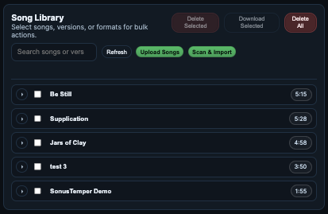
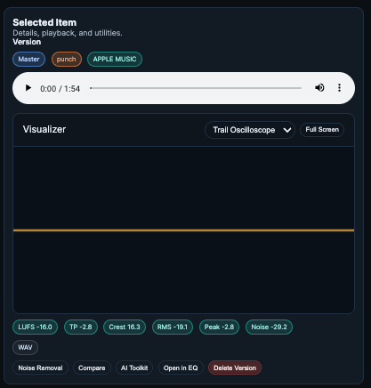
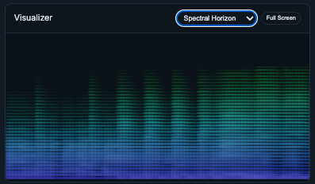

# Library

## 🧭 Table of contents
- [What it does](#what-it-does)
- [When to use it](#when-to-use-it)
- [Step-by-step](#step-by-step)
- [Controls and functions](#controls-and-functions)
- [Common pitfalls](#common-pitfalls)
- [Tips](#tips)
- [Screenshot placeholders](#screenshot-placeholders)

## What it does
The Library organizes songs and versions in a single, song‑centric index backed by SQLite. A song has one source file and multiple versions created by utilities (AI Toolkit, Noise Removal, EQ, Mastering).

## When to use it
- Importing songs and tracking outputs.
- Navigating across utilities using the same source/version.
- Downloading or deleting results.

## Step‑by‑step
1) Open **Song Library**.
2) Use **Import Song(s)** to add new audio.
3) Click a song to load it into the current utility.
4) Expand the song to view versions (mastered, cleaned, EQ’d, etc.).
5) Use the (…) menu for actions like Open in Compare or Delete.

## Controls and functions

### Song rows
- **Expand**: Shows versions for that song.
- **Add (+)**: Adds the song to a mastering input list (if available).
- **Open Player**: Loads into the player on pages that support it.
- **Delete**: Removes the song and versions from the Library.

### Version rows
- **Utility pill**: Indicates tool used (Master, Noise Removed, EQ, AITK).
- **Voicing/Profile pills**: When relevant to mastering outputs.
- **Info pill**: Opens full metrics.
- **(…) menu**: Open in Compare, Delete, Open in other utilities.

### Selected File block
- Shows current selection name and metadata.
- Used across utilities for consistent selection feedback.

> **Note:** Deleting a song removes its versions; deleting a version keeps the source.

### Visualizer
- Because why not?

## Common pitfalls
- If a song does not appear, confirm the import succeeded and the DB is writable.
- If versions are missing, verify the save path and library DB location.

## Tips
- Sources and versions are separate. Keep the source intact.
- Save versions at each stage to make A/B comparisons easy.

## Screenshot placeholders
- [Screenshot: Library list]
- [Screenshot: Expanded song with versions]

Technical Details

- **Storage**: Songs and versions live under `/data/library/songs/<song_id>/` (source + versions). Paths are stored as relative paths in SQLite.
- **Database**: Library metadata is stored in SQLite (default `/data/library/library.sqlite3`, overridable by `SONUSTEMPER_LIBRARY_DB`).
- **Core tables**: `songs`, `versions`, `renditions`, `song_metrics`, `version_metrics`.
- **Library API**:
  - `GET /api/library` returns songs + versions + metrics.
  - `POST /api/library/add_version` registers a new version.
  - `POST /api/library/delete_song` and `/api/library/delete_version` remove entries and files.
- **File delivery**: Downloads/streams use `GET /api/analyze/path?path=<rel>`.

