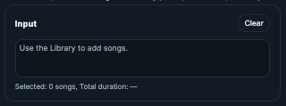
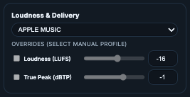
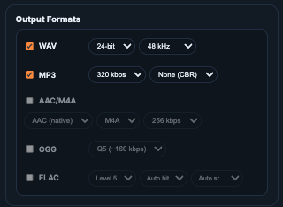
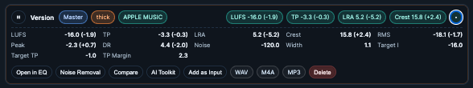

# Mastering

## 🧭 Table of contents
- [What it does](#what-it-does)
- [When to use it](#when-to-use-it)
- [Step-by-step](#step-by-step)
- [Controls and functions](#controls-and-functions)
- [Common pitfalls](#common-pitfalls)
- [Tips](#tips)
- [Screenshot placeholders](#screenshot-placeholders)

## What it does
Mastering applies voicing or presets, loudness targets, and delivery formats to produce final outputs. It creates versioned results in the Library with metrics.

## When to use it
- Finalize a cleaned track for release.
- Create consistent masters across multiple songs.

## Step-by-step
1) Add one or more songs to the input list.
2) Choose Voicing or Preset.
3) Set Loudness and True Peak limits.
4) Choose output formats.
5) Run the job and review results.

## Controls and functions

### Inputs
- **Input list**: Queue of songs to master.
- **Clear**: Removes all inputs.


### Voicing / Preset
- **Voicing**: Built-in mastering flavor.
- **Preset**: User-defined chain.
- **Strength**: Intensity of the selected voicing/preset.


### Loudness & delivery
- **Target LUFS**: Integrated loudness target.
- **True Peak**: Ceiling to prevent clipping.
- **Format options**: WAV/MP3/AAC/OGG/FLAC.


### Output Formats Selection
- Choose the formats/settings you want.
- You can also choose to just convert files.



### Output
- **Player**: A/B playback of source vs master.
- **Download**: Choose format per version.
- **Open in Compare**: Quick A/B review.

- Detailed metric available


## Common pitfalls
- If outputs are missing, check that formats were selected.
- If loudness is too hot, lower the target LUFS.

> **Note:** Mastering creates versions in the Library. The source remains unchanged.

## Tips
- Run AI Toolkit / Noise Removal / EQ before mastering.
- Use Compare to validate source vs master.

## Screenshot placeholders
- [Screenshot: Mastering inputs]
- [Screenshot: Loudness + formats]
- [Screenshot: Output player]

<details>
<summary>Technical Details</summary>

- **Filter build**: `master_pack.build_filters()` assembles EQ + compression filters from voicing/profile choices.
- **Loudness**: Two‑pass `loudnorm` (measure then apply) with final limiting.

Example loudnorm measure:
```bash
ffmpeg -y -hide_banner -loglevel error -i input.wav \
  -af "loudnorm=I=-14:TP=-1.0:LRA=7:print_format=json" \
  -f null -
```

Example loudnorm apply:
```bash
ffmpeg -y -hide_banner -loglevel error -i input.wav \
  -af "loudnorm=I=-14:TP=-1.0:LRA=7:measured_I=-15.2:measured_TP=-1.8:measured_LRA=6.1:measured_thresh=-25.0:offset=1.2,alimiter=limit=-1.0" \
  output.wav
```

- **Versions**: Each mastering run creates one version with multiple renditions (wav/mp3/ogg/etc) saved under `library/songs/<song_id>/versions/<version_id>/`.

</details>
